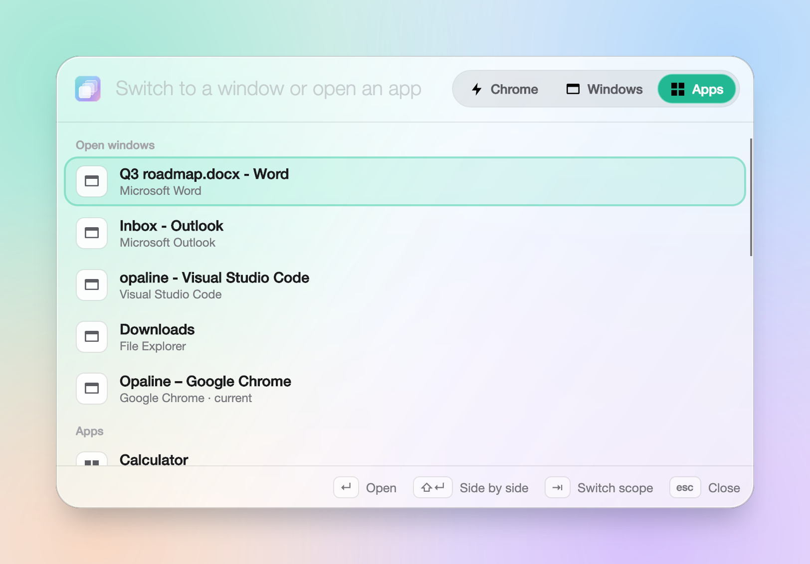
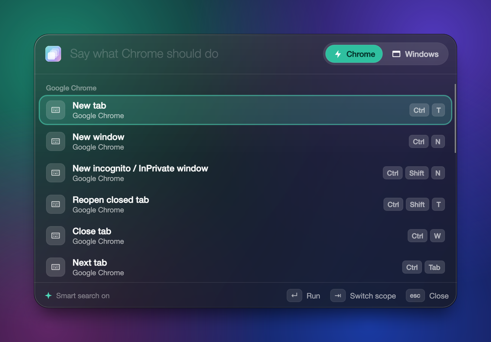

# Opaline

A clipboard manager, **Actions** palette and **launcher** for Windows 10 and 11, with a liquid glass look.
This repository hosts **release builds** only.

▶ **[Watch the 24-second video](.github/assets/opaline-video.mp4)** · [vertical cut](.github/assets/opaline-video-vertical.mp4)

## Why

I love [Jolt](https://usejolt.app/), but it doesn't support Windows yet, so I built Opaline for my own use and for my friends.
**When Jolt supports Windows, please move to Jolt.** Thanks to [Insane Arts](https://insanearts.io/) for making it.

## Get it

Download the zip for your PC from the [latest release](https://github.com/mberrishdev/opaline/releases/latest) (about 15 MB),
unzip it and run `Opaline.exe`. It updates itself.

## What it does

- **Ctrl+Shift+V: clipboard history.** Text, links, images, files and more, in one of four layouts.
  Passwords and API keys show as `***` until you press **Ctrl+H**.
- **Ctrl+Alt+F: Actions** for the app you're in: its menus and shortcuts, browser tabs, window layouts
  (halves, corners, thirds, other screen) and media keys. Three looks: Palette, Bar and Command.
- **Alt+Space: launcher and window switcher.** Switch to any open window (**Shift+Enter** puts it side by side
  with the app you were in) or open any app.

All shortcuts can be changed in Settings.

**Smart search** is powered by [TypeSafe](https://typesafe.ai)'s **Jev** model: describe what you want, like
"put two pages side by side", "the link I copied in Chrome yesterday" or "open my music app".
What you copied and your window titles are never sent.

| Smart search in the clipboard | Launcher and window switcher |
| --- | --- |
|  |  |
| **Actions** | **Smart search in Actions** |
|  |  |

## Bugs and ideas

Found a bug or want a feature? [Open an issue](https://github.com/mberrishdev/opaline/issues/new/choose).
For bugs, attach the log from **Settings → About → Open logs** if you can.
