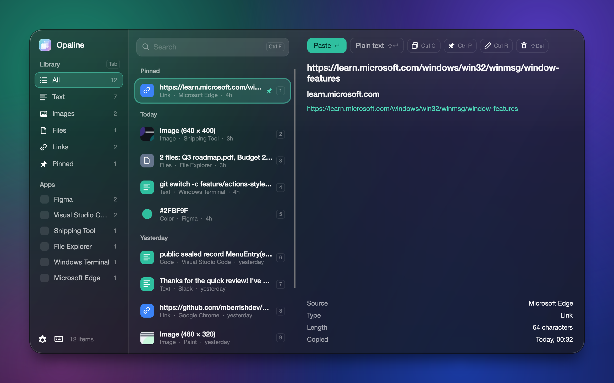
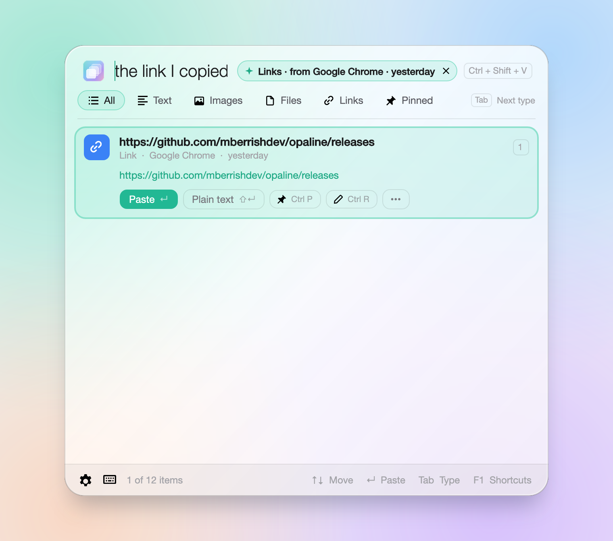
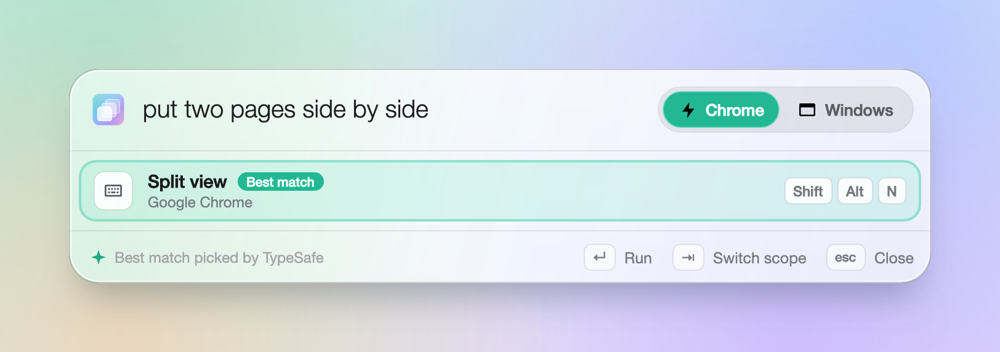

# Opaline

A clipboard manager and **Actions** palette for Windows 10 and 11, with a liquid glass look.
This repository hosts **release builds** only.

## Why

I love [Jolt](https://usejolt.app/), but it doesn't support Windows yet, so I built Opaline for my own use and for my friends.
**When Jolt supports Windows, please move to Jolt.** Thanks to [Insane Arts](https://insanearts.io/) for making it.

## Get it

Download the zip for your PC from the [latest release](https://github.com/mberrishdev/opaline/releases/latest), unzip it and run `Opaline.exe`.
It updates itself.

- **Ctrl+Shift+V**: clipboard history
- **Ctrl+Alt+F**: Actions for the app you're in (menus, shortcuts, tabs, window layouts, media)

Both shortcuts can be changed in Settings.

**Smart search** is powered by [TypeSafe](https://typesafe.ai)'s **Jev** model: describe what you want, like
"put two pages side by side" or "the link I copied in Chrome yesterday". What you copied is never sent.

| Smart search in the clipboard | Smart search in Actions |
| --- | --- |
|  |  |

## Bugs and ideas

Found a bug or want a feature? [Open an issue](https://github.com/mberrishdev/opaline/issues/new/choose).
For bugs, attach the log from **Settings → About → Open logs** if you can.
